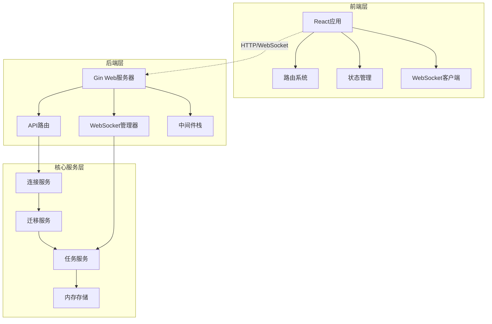
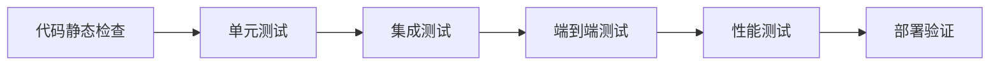
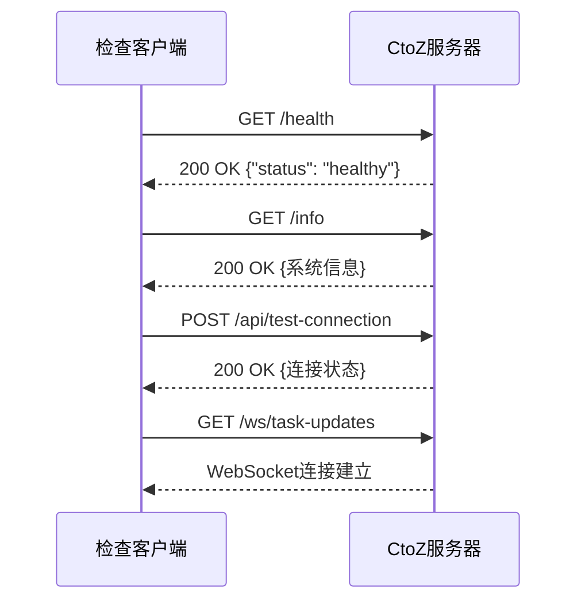
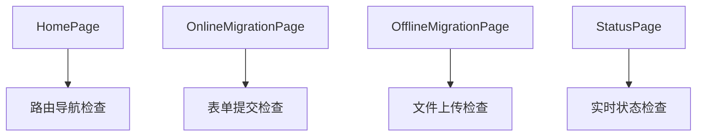
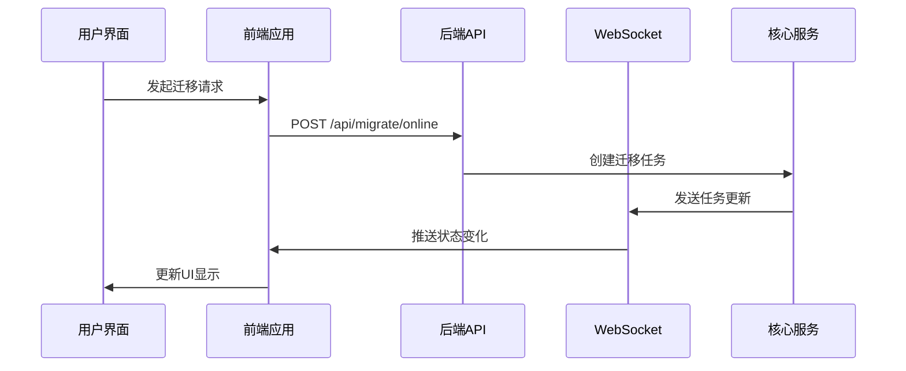
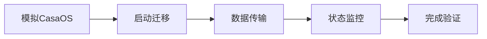
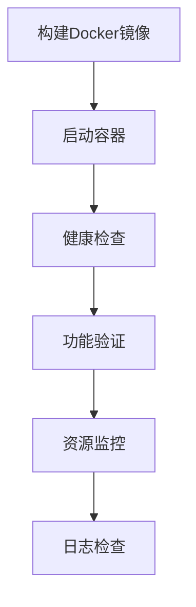
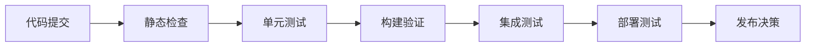

# CtoZ代码执行检查设计文档

## 概述

本文档描述了CtoZ（CasaOS到ZimaOS迁移工具）项目的代码执行检查方案。CtoZ是一个全栈应用，包含Go后端和React前端，提供在线和离线数据迁移功能。该设计文档旨在建立完整的执行检查流程，确保代码符合预期功能要求。

## 技术架构

### 系统架构图



### 技术栈

- **前端**: React 18.2.0 + TypeScript + Tailwind CSS + Vite
- **后端**: Go 1.20 + Gin框架 + Gorilla WebSocket
- **部署**: Docker + Docker Compose

## 代码执行检查架构

### 检查层级架构



### 检查组件定义

#### 1. 前端检查组件

| 组件 | 检查项 | 工具 | 预期结果 |
|------|-------|------|----------|
| 类型检查 | TypeScript编译 | `tsc --noEmit` | 无类型错误 |
| 代码规范 | ESLint规则 | `eslint . --ext ts,tsx` | 0个警告 |
| 构建验证 | Vite构建 | `npm run build` | 成功生成dist目录 |
| 组件渲染 | React组件 | Jest/Testing Library | 所有组件正常渲染 |

#### 2. 后端检查组件

| 组件 | 检查项 | 工具 | 预期结果 |
|------|-------|------|----------|
| 语法检查 | Go编译 | `go build` | 编译成功 |
| 代码格式 | Go格式化 | `go fmt` | 代码格式规范 |
| 依赖检查 | 模块验证 | `go mod verify` | 依赖完整性验证 |
| API测试 | HTTP端点 | 自动化测试 | 所有API正常响应 |

#### 3. 系统级检查组件

| 组件 | 检查项 | 方法 | 预期结果 |
|------|-------|------|----------|
| 容器构建 | Docker镜像 | `docker build` | 镜像构建成功 |
| 服务启动 | 应用启动 | `docker-compose up` | 服务正常启动 |
| 端口监听 | 网络连接 | 端口扫描 | 8080端口可访问 |
| WebSocket | 实时通信 | 连接测试 | WebSocket连接正常 |

## API端点检查规范

### 核心API检查



### API检查用例

#### 健康检查端点
- **路径**: `GET /health`
- **预期响应**: HTTP 200, JSON格式健康状态
- **检查目的**: 验证服务基本可用性

#### 系统信息端点
- **路径**: `GET /info`
- **预期响应**: 系统版本、API文档等信息
- **检查目的**: 验证API文档访问

#### 连接测试端点
- **路径**: `POST /api/test-connection`
- **请求体**: CasaOS/ZimaOS连接参数
- **预期响应**: 连接状态和错误信息
- **检查目的**: 验证核心连接功能

#### 迁移端点
- **在线迁移**: `POST /api/migrate/online`
- **数据导出**: `POST /api/migrate/export`
- **数据导入**: `POST /api/migrate/import`
- **检查目的**: 验证核心业务功能

## 前端组件检查规范

### 页面组件检查



### 组件检查用例

#### 路由系统检查
- **组件**: React Router配置
- **检查项**: 所有路由正确映射到对应页面
- **预期结果**: 导航正常，无404错误

#### 状态管理检查
- **组件**: Zustand状态存储
- **检查项**: 状态更新和持久化
- **预期结果**: 状态正确同步

#### WebSocket连接检查
- **组件**: WebSocket客户端
- **检查项**: 实时消息接收
- **预期结果**: 任务状态实时更新

## 数据流检查架构

### 完整数据流验证



### 关键数据流检查点

1. **请求处理流**: HTTP请求 → 路由 → 处理器 → 服务层
2. **状态同步流**: 服务更新 → WebSocket → 前端状态 → UI更新
3. **错误处理流**: 异常捕获 → 错误响应 → 用户提示

## 集成测试规范

### 在线迁移集成测试



#### 测试场景
1. **成功迁移场景**: 完整的在线迁移流程
2. **连接失败场景**: 网络异常处理
3. **数据错误场景**: 传输中断恢复
4. **并发处理场景**: 多任务并行执行

### 离线迁移集成测试

#### 导出流程测试
- 数据导出完整性
- 导出文件格式验证
- 下载功能验证

#### 导入流程测试  
- 文件上传功能
- 数据解析验证
- 导入状态跟踪

## 性能基准检查

### 性能指标定义

| 指标类型 | 测量项 | 期望值 | 检查方法 |
|----------|--------|--------|----------|
| 响应时间 | API响应延迟 | < 200ms | HTTP压测 |
| 并发能力 | 同时连接数 | 100+ WebSocket | 负载测试 |
| 内存使用 | 运行时内存 | < 500MB | 监控工具 |
| CPU使用率 | 处理器占用 | < 80% | 系统监控 |

### 压力测试场景

1. **API压力测试**: 高并发HTTP请求
2. **WebSocket压力测试**: 大量实时连接
3. **文件传输测试**: 大文件上传下载
4. **长时间运行测试**: 24小时稳定性

## 部署验证检查

### Docker化检查流程



### 部署检查项

#### 容器环境检查
- Docker镜像构建成功
- 容器正常启动
- 端口映射正确
- 环境变量配置

#### 服务可用性检查
- HTTP服务响应
- WebSocket连接建立
- 静态文件访问
- API功能正常

#### 运维检查
- 日志输出格式
- 错误监控机制
- 资源使用情况
- 重启恢复能力

## 自动化检查流程

### CI/CD检查管道



### 检查阶段定义

1. **预提交检查**: 代码格式、类型检查
2. **构建阶段检查**: 编译、打包验证
3. **测试阶段检查**: 单元测试、集成测试
4. **部署阶段检查**: 容器化、功能验证
5. **生产阶段检查**: 性能监控、稳定性验证

## 检查工具配置

### 前端检查工具

```json
{
  "scripts": {
    "check": "tsc --noEmit",
    "lint": "eslint . --ext ts,tsx --report-unused-disable-directives --max-warnings 0",
    "build": "tsc && vite build",
    "test": "vitest",
    "preview": "vite preview"
  }
}
```

### 后端检查工具

```bash
# Go代码检查命令
go fmt ./...
go vet ./...
go test ./...
go build -o ctoz backend/cmd/main.go
```

### Docker检查命令

```bash
# 容器化检查
docker build -t ctoz .
docker-compose up -d
curl http://localhost:8080/health
curl http://localhost:8080/info
```