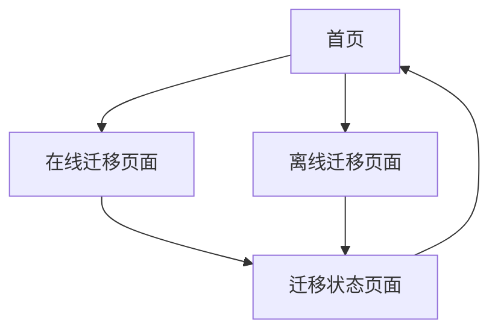

# CasaOS到ZimaOS迁移工具 - 产品需求文档

## 1. Product Overview

本产品是一个Docker化的迁移工具，帮助用户将CasaOS系统上的应用和数据迁移到ZimaOS系统。支持在线直接迁移和离线打包迁移两种方式，为用户提供灵活的迁移选择。

- 解决CasaOS用户迁移到ZimaOS时的数据和应用转移问题
- 目标用户：需要从CasaOS迁移到ZimaOS的个人和企业用户
- 市场价值：简化系统迁移流程，降低用户迁移成本和技术门槛

## 2. Core Features

### 2.1 User Roles

| Role | Registration Method | Core Permissions |
|------|---------------------|------------------|
| 普通用户 | 无需注册，直接使用 | 可使用所有迁移功能 |

### 2.2 Feature Module

我们的迁移工具包含以下主要页面：
1. **首页**：功能选择、迁移方式介绍
2. **在线迁移页面**：源系统和目标系统连接配置、迁移执行
3. **离线迁移页面**：数据导出、数据导入、迁移执行
4. **迁移状态页面**：进度显示、日志查看、结果反馈

### 2.3 Page Details

| Page Name | Module Name | Feature description |
|-----------|-------------|---------------------|
| 首页 | 功能选择区 | 显示在线迁移和离线迁移两个选项，提供功能介绍和使用指南 |
| 首页 | 系统状态区 | 显示当前工具版本、系统要求、连接状态检查 |
| 在线迁移页面 | CasaOS连接配置 | 输入CasaOS的IP地址、用户名、密码，测试连接状态 |
| 在线迁移页面 | ZimaOS连接配置 | 输入ZimaOS的IP地址、用户名、密码，测试连接状态 |
| 在线迁移页面 | 迁移选项配置 | 选择要迁移的应用、数据类型、迁移策略 |
| 在线迁移页面 | 迁移执行控制 | 开始迁移、暂停、取消操作，实时显示迁移进度 |
| 离线迁移页面 | 数据导出模块 | 连接CasaOS，选择导出内容，生成迁移包并提供下载 |
| 离线迁移页面 | 数据导入模块 | 连接ZimaOS，上传迁移包，执行导入操作 |
| 迁移状态页面 | 进度显示 | 实时显示迁移进度条、当前操作状态、预计剩余时间 |
| 迁移状态页面 | 日志查看 | 显示详细的迁移日志、错误信息、操作记录 |
| 迁移状态页面 | 结果反馈 | 显示迁移成功/失败状态、统计信息、后续操作建议 |

## 3. Core Process

**在线迁移流程：**
用户进入在线迁移页面 → 配置CasaOS连接信息并测试 → 配置ZimaOS连接信息并测试 → 选择迁移内容和选项 → 开始迁移 → 查看迁移状态和进度 → 完成迁移并查看结果

**离线迁移流程：**
用户进入离线迁移页面 → 配置CasaOS连接信息 → 选择导出内容 → 生成并下载迁移包 → 配置ZimaOS连接信息 → 上传迁移包 → 执行导入 → 查看迁移状态和结果

## 4. User Interface Design

### 4.1 Design Style

- 主色调：深蓝色 (#2563eb)，辅助色：浅灰色 (#f8fafc)
- 按钮样式：圆角按钮，悬停效果，主要按钮使用渐变色
- 字体：系统默认字体，标题16-20px，正文14px，说明文字12px
- 布局风格：卡片式布局，顶部导航，左右分栏设计
- 图标风格：线性图标，统一使用Feather Icons或类似风格

### 4.2 Page Design Overview

| Page Name | Module Name | UI Elements |
|-----------|-------------|-------------|
| 首页 | 功能选择区 | 两个大型卡片按钮，图标+标题+描述，悬停放大效果 |
| 首页 | 系统状态区 | 状态指示器，版本信息，连接测试按钮 |
| 在线迁移页面 | 连接配置区 | 表单输入框，测试连接按钮，状态指示灯 |
| 在线迁移页面 | 迁移控制区 | 进度条，控制按钮组，实时状态显示 |
| 离线迁移页面 | 导出模块 | 文件选择器，下载按钮，进度指示器 |
| 离线迁移页面 | 导入模块 | 文件上传区，拖拽上传支持，上传进度条 |
| 迁移状态页面 | 进度显示 | 环形进度条，步骤指示器，时间估算 |
| 迁移状态页面 | 日志区域 | 滚动文本框，日志级别标识，搜索过滤功能 |

### 4.3 Responsiveness

产品采用桌面优先设计，支持移动端自适应。考虑触摸交互优化，按钮和输入框适当增大，支持手势操作。