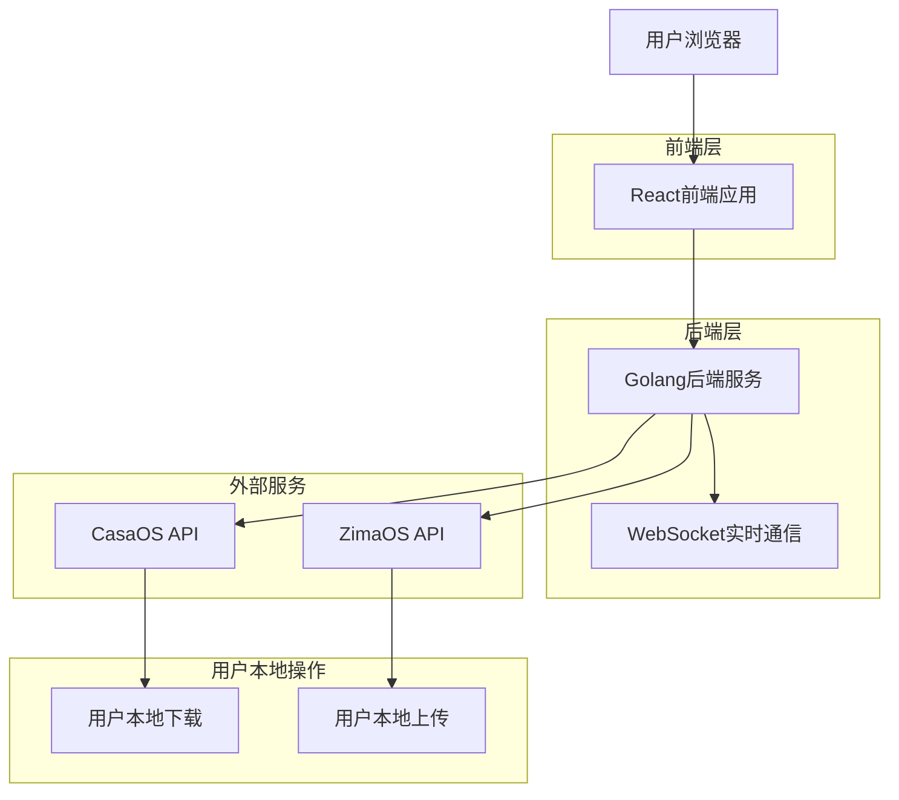
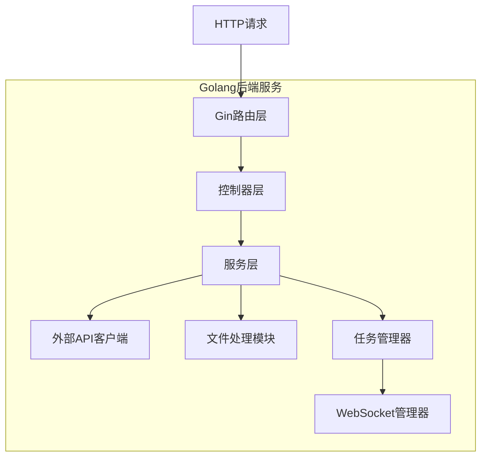

# CasaOS到ZimaOS迁移工具 - 技术架构文档

## 1. Architecture design



## 2. Technology Description

* Frontend: React\@18 + TypeScript + Tailwind CSS + Vite

* Backend: Golang + Gin框架 + Gorilla WebSocket

* 数据存储: 纯内存存储，无需持久化数据库

* 容器化: Docker + Docker Compose

## 3. Route definitions

| Route              | Purpose           |
| ------------------ | ----------------- |
| /                  | 首页，显示迁移方式选择和系统状态  |
| /online-migration  | 在线迁移页面，配置源和目标系统连接 |
| /offline-migration | 离线迁移页面，数据导出和导入操作  |
| /migration-status  | 迁移状态页面，显示进度和日志    |

## 4. API definitions

### 4.1 Core API

系统连接测试

```
POST /api/test-connection
```

Request:

| Param Name   | Param Type | isRequired | Description          |
| ------------ | ---------- | ---------- | -------------------- |
| host         | string     | true       | 目标系统IP地址             |
| username     | string     | true       | 用户名                  |
| password     | string     | true       | 密码                   |
| system\_type | string     | true       | 系统类型 (casaos/zimaos) |

Response:

| Param Name   | Param Type | Description |
| ------------ | ---------- | ----------- |
| success      | boolean    | 连接是否成功      |
| message      | string     | 连接状态信息      |
| system\_info | object     | 系统基本信息      |

在线迁移执行

```
POST /api/online-migration
```

Request:

| Param Name         | Param Type | isRequired | Description |
| ------------------ | ---------- | ---------- | ----------- |
| source             | object     | true       | CasaOS连接信息  |
| target             | object     | true       | ZimaOS连接信息  |
| migration\_options | object     | true       | 迁移选项配置      |

Response:

| Param Name | Param Type | Description |
| ---------- | ---------- | ----------- |
| task\_id   | string     | 迁移任务ID      |
| status     | string     | 任务状态        |

离线数据导出

```
POST /api/export-data
```

Request:

| Param Name      | Param Type | isRequired | Description |
| --------------- | ---------- | ---------- | ----------- |
| source          | object     | true       | CasaOS连接信息  |
| export\_options | object     | true       | 导出选项        |

Response:

| Param Name    | Param Type | Description |
| ------------- | ---------- | ----------- |
| task\_id      | string     | 导出任务ID      |
| download\_instructions | object | 用户下载操作指引 |

注意：数据导出后，用户需要直接从CasaOS系统下载相关文件，而不是从CtoZ应用下载。

离线数据导入

```
POST /api/import-data
```

Request:

| Param Name    | Param Type | isRequired | Description |
| ------------- | ---------- | ---------- | ----------- |
| target        | object     | true       | ZimaOS连接信息  |
| package\_file | file       | true       | 迁移包文件       |

Response:

| Param Name | Param Type | Description |
| ---------- | ---------- | ----------- |
| task\_id   | string     | 导入任务ID      |
| status     | string     | 导入状态        |

WebSocket实时通信

```
WS /ws/task-updates/{task_id}
```

实时推送详细执行步骤和状态信息：

| 消息类型 | 数据格式 | 描述 |
|---------|---------|-----|
| step_start | {"type":"step_start", "step":"连接CasaOS", "timestamp":"..."} | 开始执行某个步骤 |
| step_progress | {"type":"step_progress", "step":"数据导出", "progress":45, "message":"正在导出应用配置..."} | 步骤执行进度 |
| step_complete | {"type":"step_complete", "step":"连接测试", "result":"success"} | 步骤完成 |
| step_error | {"type":"step_error", "step":"连接ZimaOS", "error":"连接超时"} | 步骤执行错误 |
| console_output | {"type":"console_output", "message":"[INFO] 开始扫描应用列表..."} | 控制台式输出信息 |

## 5. Server architecture diagram



## 6. 内存数据结构

### 6.1 数据存储说明

本应用采用纯内存存储，不使用持久化数据库。所有任务状态、连接信息和日志都存储在内存中，应用重启后数据会丢失。这种设计适合轻量级迁移工具的使用场景。

### 6.2 核心数据结构定义

```go
// 迁移任务结构
type MigrationTask struct {
    ID          string                 `json:"id"`
    Type        string                 `json:"type"` // online/offline-export/offline-import
    Status      string                 `json:"status"` // pending/running/completed/failed
    Progress    int                    `json:"progress"`
    Source      *SystemConnection      `json:"source,omitempty"`
    Target      *SystemConnection      `json:"target,omitempty"`
    Options     map[string]interface{} `json:"options"`
    Logs        []MigrationLog         `json:"logs"`
    Result      map[string]interface{} `json:"result,omitempty"`
    CreatedAt   time.Time              `json:"created_at"`
    UpdatedAt   time.Time              `json:"updated_at"`
}

// 系统连接信息
type SystemConnection struct {
    Host       string `json:"host"`
    Username   string `json:"username"`
    Password   string `json:"password,omitempty"` // 不返回给前端
    SystemType string `json:"system_type"` // casaos/zimaos
    Verified   bool   `json:"verified"`
}

// 迁移日志
type MigrationLog struct {
    Level     string    `json:"level"` // info/warning/error
    Message   string    `json:"message"`
    Timestamp time.Time `json:"timestamp"`
}

// WebSocket消息结构
type WSMessage struct {
    Type      string                 `json:"type"` // step_start/step_progress/step_complete/step_error/console_output
    Step      string                 `json:"step,omitempty"`
    Progress  int                    `json:"progress,omitempty"`
    Message   string                 `json:"message,omitempty"`
    Result    string                 `json:"result,omitempty"`
    Error     string                 `json:"error,omitempty"`
    Timestamp time.Time              `json:"timestamp"`
    Data      map[string]interface{} `json:"data,omitempty"`
}

// 下载指引信息
type DownloadInstructions struct {
    CasaOSHost    string   `json:"casaos_host"`
    DownloadPaths []string `json:"download_paths"`
    Instructions  []string `json:"instructions"`
    PackageName   string   `json:"package_name"`
}
```

